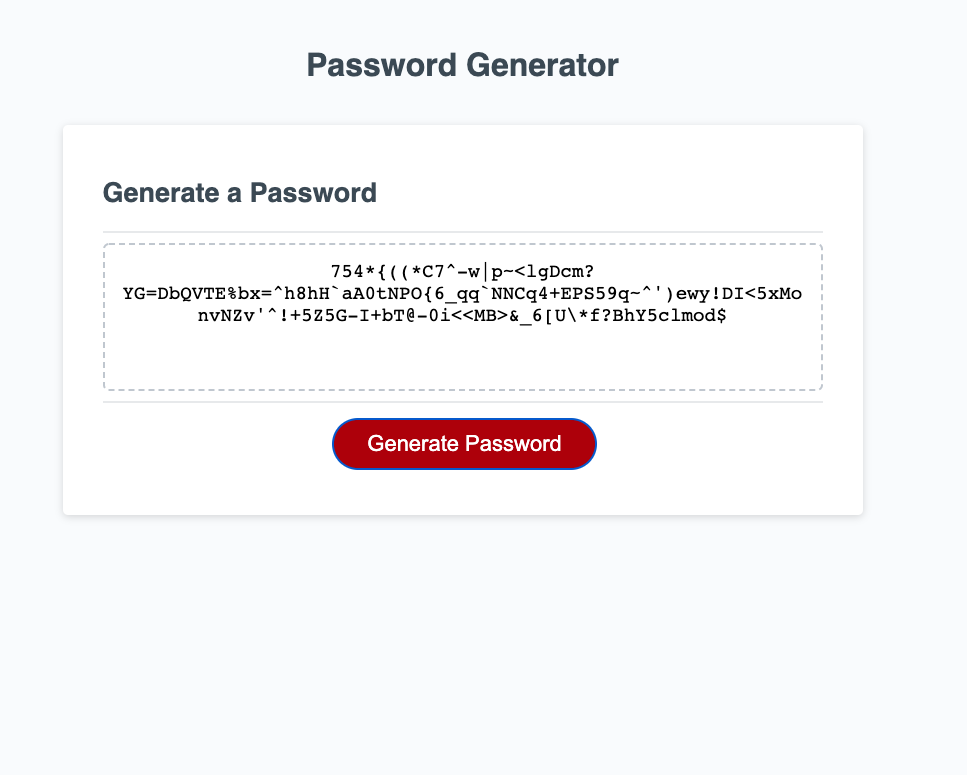

# 03-JavaScript-Password-Generator

## Description

This is the module 03 "Javascript Password Generator" by Jonathan Shogren. The challange was to create a password generator written in javascript that will ask the user for input, and provide a password based on the choices the user made.

Here is a link to the live finished page: https://shogren.github.io/03-JavaScript-Password-Generator/

## User Story

> AS AN employee with access to sensitive data
>
> I WANT to randomly generate a password that meets certain criteria
>
> SO THAT I can create a strong password that provides greater security

## Screenshot

Here is a screenshot of the finished site:

## Additional Notes

* What a fun project! I'm super curious to see how other classmates came to the same results.

* I set the password to default to all lowercase in the event that the user chooses "no" for each prompt.

* I'd be interested in trying to build this same project but using elements on the page instead of prompts!

* This will be fun to revisit in a few years when I have much more experience under my belt. I'm sure there are cleaner ways to accomplish this task, it feels like I'm writing code that is taking 3 left turns to make a right sometimes.
